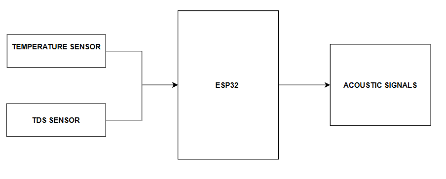
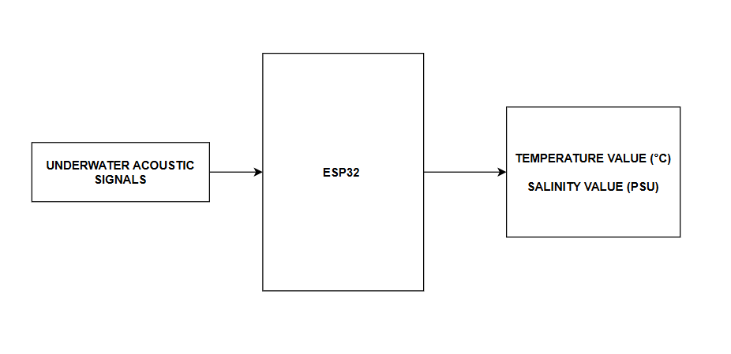

# Underwater Acoustic Sensor Communication Prototype

<p align="center">
  <strong>Audio-frequency FSK communication for transmitting water sensor data between embedded nodes</strong>
</p>

<p align="center">
  
  
  
</p>

## Project at a Glance

| Item | Details |
|---|---|
| Domain | Embedded communication |
| Modulation | Binary FSK |
| Data | Temperature and TDS-oriented readings |
| Transmitter | Tone-based embedded node |
| Receiver | Frequency detection + LCD output |
| Status | Academic communication prototype |

## System Design

<p align="center">
  
  
</p>

## Overview

The transmitter converts sensor values into characters, converts each character into binary data, and sends the bits using two audio frequencies. The receiver estimates incoming frequency, reconstructs the byte stream, parses the payload, and displays the decoded values.

## Communication Flow


## Technology Stack

- ESP32 / Arduino
- C++
- DallasTemperature / DS18B20
- Analog TDS input
- Microphone input
- I2C LCD
- Binary FSK

## Repository Structure

```text
Underwater/
├── Transmiter/Transmiter.ino
├── Receiver/Receiver.ino
├── TRANSMITER_BLOCK.png
├── TRANSMITER_FLOW.png
├── TRANSMITTER_CIRCUIT.png
├── RECEIVER_BLOCK.png
├── RECEIVER_FLOW.png
└── RECIEVER_CIRCUIT.png
```

## Future Work

- Add packet framing
- Add CRC / checksum validation
- Improve synchronization
- Increase bit rate
- Characterize underwater range and BER
- Use FFT/Goertzel-based frequency detection
- Add retransmission and packet IDs

## Author

**Sadik Shaik**

Computer Engineering · Embedded Systems · Digital Communication
